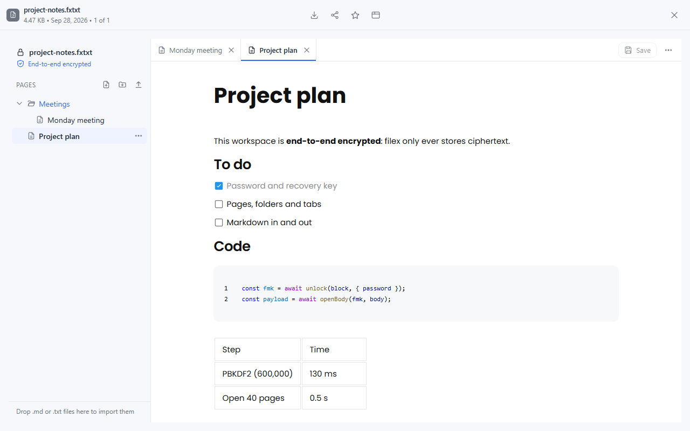
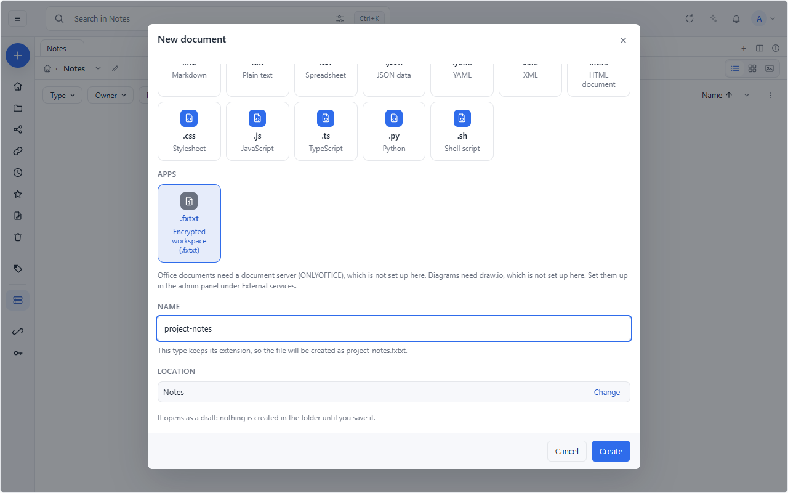
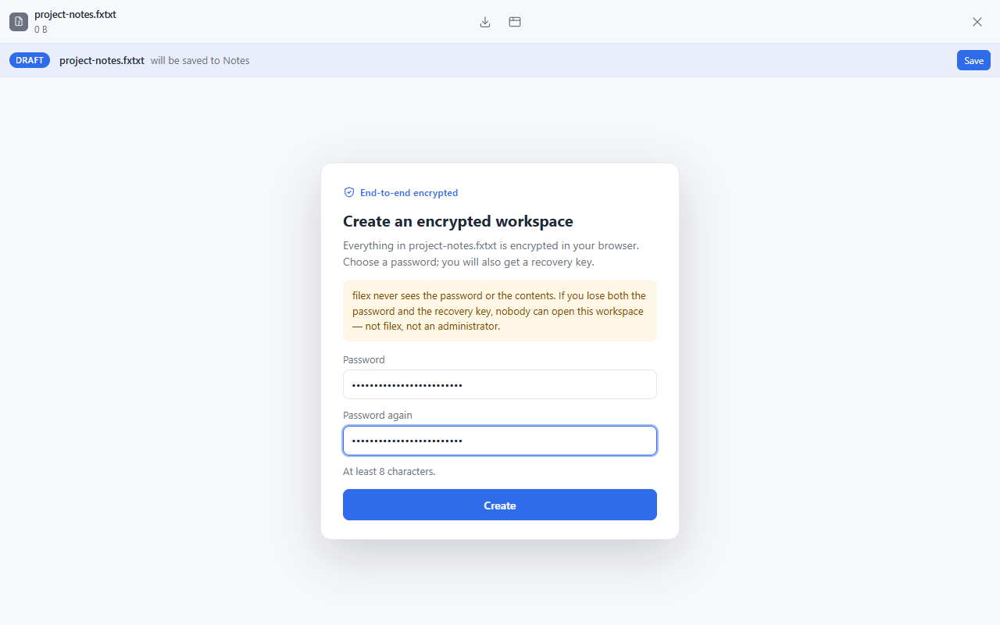
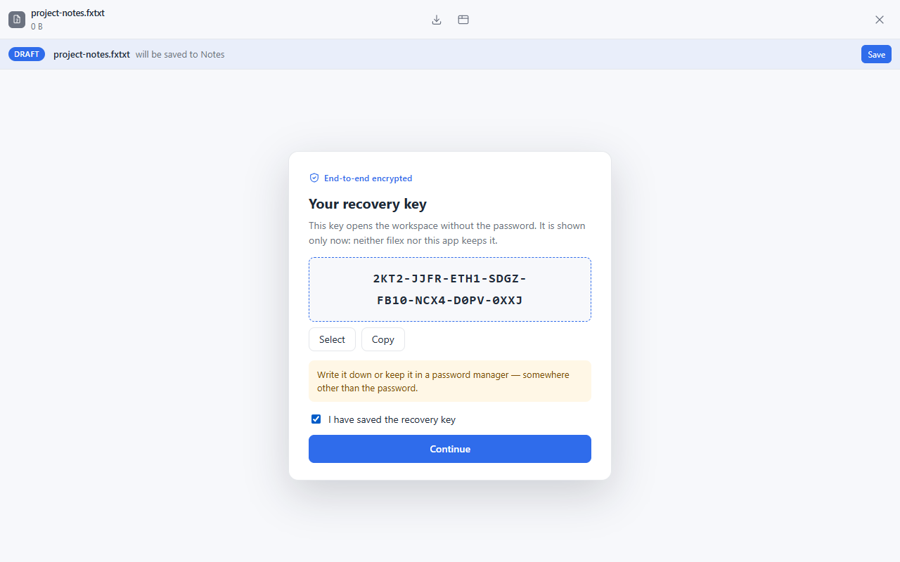
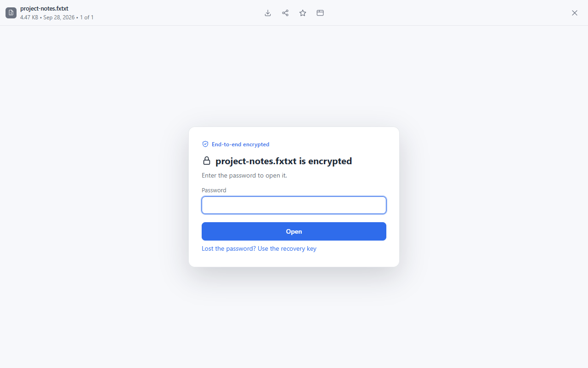
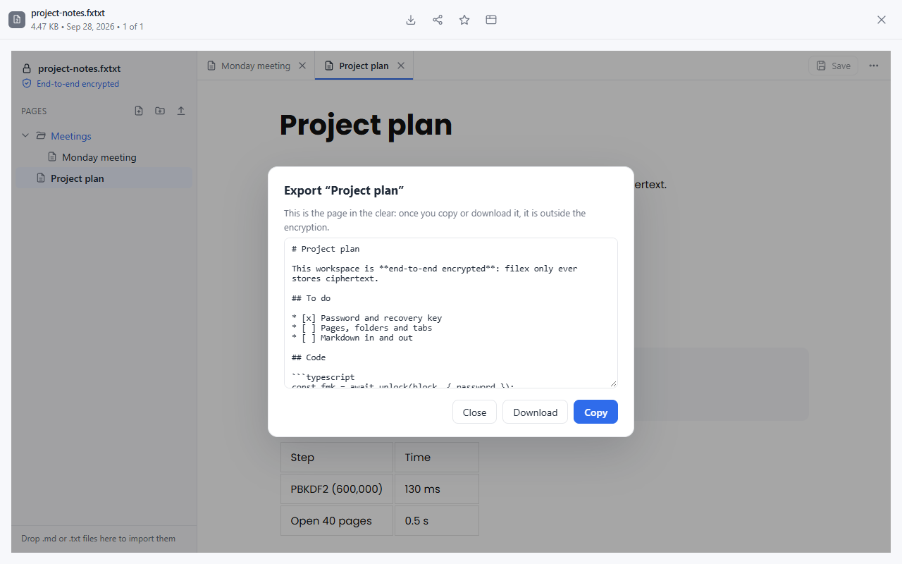

# filextext

An **end-to-end encrypted text workspace** for [filex](https://github.com/BRF-Tech/filex),
the self-hosted file manager — in a single `.fxtxt` file. Pages and folders
on the left, tabs on top, and AFFiNE's editor,
[BlockSuite](https://github.com/toeverything/AFFiNE/tree/v0.27.4/blocksuite),
in the middle: headings, lists, to-dos, code with highlighting, tables,
callouts, LaTeX, images, links between pages, Markdown import and export.

Everything is encrypted **in your browser**. filex stores ciphertext and
never sees the password, the recovery key, the keys, a page title or a word
of the text.



- [What it is](#what-it-is)
- [Security model](#security-model)
- [Installing it on filex](#installing-it-on-filex)
- [Using it](#using-it)
- [The file format](#the-file-format)
- [Building](#building)
- [Developing and testing](#developing-and-testing)
- [Releasing](#releasing)
- [Licence](#licence)

## What it is

filextext is a filex **app with its own interface and no module**: filex
serves its HTML and JavaScript from the app's package and runs it in a
sandboxed frame. The app talks to filex only through the bridge SDK
(`@brftech/filex-app-ui`), and all that crosses it is:

| From filex to the app | From the app to filex |
|---|---|
| the opened file's **encrypted** bytes | the workspace's **encrypted** bytes, on Save |
| the language and the theme | "there are unsaved changes", the frame's title, short notices |
| | on your click only: a page you export (Download) or copy |

The editor keeps the workspace in memory as Yjs documents — BlockSuite's own
page collection plus a folder tree in the shape of AFFiNE's "Organize".
Saving serialises them into a zip (Yjs state, a Markdown copy of every page,
the images), encrypts it and hands the ciphertext to filex, which writes it
as a new version of the file.

## Security model

### The keys

The key hierarchy is **filex's own end-to-end encryption**, unchanged — the
same algorithms, parameters and recovery-key format as filex's encrypted
folders:

```
password ──PBKDF2-SHA256, 600,000 iterations──▶ KEK  ─┐
recovery key ──HKDF-SHA256─────────────────────▶ RKEK ─┴─▶ unwrap the file master key (FMK)

every save: a fresh data key (DEK), wrapped by the FMK, and fresh nonces (AES-256-GCM)
```

- The password and the recovery key each unwrap the same FMK; neither is
  stored anywhere. The recovery key is 160 random bits, shown **once**, when
  it is made.
- **A new password is a new key.** Changing the password — or setting a new
  one after opening with the recovery key — makes a new FMK and a new
  recovery key and re-encrypts the workspace. From then on neither the old
  password nor the old recovery key opens the file, not even for someone
  who kept a copy of the old key block.
- All cryptography is the browser's WebCrypto. Keys are made non-extractable
  where WebCrypto allows it, and **Lock** drops them from memory.

### What filex, its administrators and its storage see

| They see | They never see |
|---|---|
| that a file `something.fxtxt` exists, its size, its times, how many versions it has | the password, the recovery key, any key |
| who opened and saved it (filex's own logs) | page titles, folder names, the text, the images |
| the ciphertext | anything you did not export yourself |

If you lose **both** the password and the recovery key, nobody can open the
file — not filex, not an administrator, not the authors of this app.

### What it does not protect against

Be clear about these before trusting it with anything:

- **The code comes from the server.** Like every encryption that runs in a
  web page, filextext is only as honest as the code the browser is given. A
  filex that is compromised, or an administrator who installs a different
  build of this app, can serve an interface that sends your password away.
  What limits this: filex pins the interface package by its SHA-256 at
  install, serves only files from that package, and never updates an app by
  itself — an administrator approves each version. The build is reproducible,
  so you can check that the hash filex shows is the hash of this source
  ([Building](#building)).
- **The sandbox is not a wall against a malicious app.** filex runs the
  interface in an opaque-origin frame with `connect-src 'none'`, no storage
  and no cookies, but browsers cannot entirely stop a page from sending data
  out (WebRTC ignores a page's content policy; filex closes what it can).
  filextext never needs the network; the point is that you should trust an
  app with an interface as far as you trust its author, and this one is open
  source for that reason.
- **Older versions keep their old key.** A version of the file saved before a
  password change still opens with the password and recovery key it was
  saved with. If you change the password because it leaked, also delete the
  file's older versions in filex.
- **What you take out is plaintext.** A page you export, download or copy is
  outside the encryption by your choice; the export dialog says so.
- **Your own device** — a keylogger, a compromised browser or extension —
  is out of scope, as it is for any end-to-end encryption.
- **Metadata** (the file's name, size, times and version count) is visible
  to filex. Name the file accordingly.

## Installing it on filex

It needs **filex 0.48.0 or later** — the version that runs app interfaces
(the manifest says `"filex": ">=0.48.0"`).

1. **Admin → Plugins → Apps → Install an app → GitHub repository.**
2. **Repository:** `BRF-Tech/filextext-app`. **Ref:** the tag of a release
   (`v0.1.1`) — the repository's *Releases* page lists them. Give the tag,
   not a branch: the interface package is a release asset.
3. filex fetches `filex-app.json` at that tag, downloads `ui.zip` from the
   release and refuses it unless its SHA-256 matches the manifest's. Read
   the review, tick the box, **Install**.

The review lists:

| Permission | Why |
|---|---|
| `files:read` | to open the `.fxtxt` file you open with it |
| `files:write` | to save it — only that file |
| `ui` (has its own interface) | the editor runs in filex's sandboxed frame |
| `ui-viewer:.fxtxt` | `.fxtxt` files open with filextext |
| `ui-new:.fxtxt` | **New document → Encrypted workspace (.fxtxt)** |
| `ui:download` | **Download** in the export dialog, on your click |

No address outside the package, no `eval`, no WebAssembly compilation, no
reading of its own package.

**Updates.** Installed from GitHub, the app follows this repository: filex
checks the releases once a day and tells the administrator about a newer
version this filex can run. Nothing updates by itself; the administrator
approves it.

**Without GitHub access.** Download `filex-app.json` and `ui.zip` from a
release and use **Install an app → Upload files** instead (no updates then:
an uploaded app has no source to check).

## Using it

<p>


</p>

- **Create.** In filex, **New → New document → Encrypted workspace (.fxtxt)**
  (an empty `.fxtxt` opened with the app does the same). Choose a password
  (at least 8 characters). The workspace is made, and its **recovery key**
  is shown — once. Keep it somewhere other than the password, tick "I have
  saved the recovery key" and continue. A new document is a filex draft until
  its first Save puts it in the folder.
- **Open.** Open the file and type the password.
- **Lost the password?** "Use the recovery key" opens the workspace with the
  32-character key, then asks for a **new password** before anything else —
  and shows the **new** recovery key that comes with it.
- **Change the password** from the ⋯ menu, proving it is you with the
  current password or the recovery key. You get a new recovery key; the old
  one stops working.

<p>


</p>

- **Pages and folders.** New page, new folder, rename, move, delete — from the
  buttons, a row's ⋯ menu, right-click, or drag and drop.
- **Markdown and text.** Import `.md` / `.txt` files (the button, or drop
  them on the sidebar); a leading `# Heading` becomes the page's title.
  Pasting Markdown into a page works too. Export a page from the ⋯ menu as
  Markdown or plain text: the dialog shows it and offers **Copy** and
  **Download** (the file goes to your own disk through filex; nothing is
  written to the server).
- **Images** pasted or dropped into a page are stored inside the encrypted
  file.
- **Save** with the Save button, Ctrl+S, or filex's own Save. **Lock** drops
  the keys from memory and asks for the password again.
- English and Turkish; it follows filex's language and theme.



## The file format

A `.fxtxt` is a filex encrypted-folder marker (the key block) and a filex
encrypted file (the body) in one file:

```
"filextxt" | version (1 byte) | key block length (4 bytes, big-endian) | key block (JSON) | body
```

The full specification — the key block, the body, the payload inside it,
limits, what a reader must refuse, and test vectors — is
[docs/FORMAT.md](docs/FORMAT.md). Three independent implementations agree
on its vectors: this app (TypeScript), `tools/fxtxt_ref.py` (Python, which
also generates them) and filex's own Go decryptor for encrypted folders.

`tools/fxtxt_ref.py` opens a `.fxtxt` without a browser — your way out if
you ever need one:

```bash
pip install cryptography
python tools/fxtxt_ref.py decrypt notes.fxtxt -o notes.zip   # asks for the password
unzip notes.zip 'pages/*'                                    # every page as Markdown
```

(`--recovery-key` opens it with the recovery key instead.)

## Building

Two stages, because current BlockSuite is not published to npm: it lives as
source inside the AFFiNE monorepo.

**1. The editor library** — `vendor/blocksuite/`, committed, rebuilt rarely.
On Linux (WSL works; keep the work directory on the Linux file system, not
under `/mnt/<drive>`), with Node 22 and git:

```bash
bash blocksuite/scripts/1-clone-affine.sh     # AFFiNE v0.27.4, the blocksuite/ subtree only
bash blocksuite/scripts/2-setup-workspace.sh  # a yarn 4 workspace + our editor package
bash blocksuite/scripts/3-build-editor.sh     # vite library build → ~/fxtxt-bs/editor/dist
```

then copy `~/fxtxt-bs/editor/dist/` over `vendor/blocksuite/`. The entry is
`blocksuite/editor/src/index.ts`: a curated **page-mode** subset of AFFiNE's
view extensions (no whiteboard, no database views, no embeds that fetch link
previews), an in-memory workspace, the Markdown and text adapters, and two
aliases that keep the bundle inside a strict content policy — shiki's
JavaScript regex engine instead of its WebAssembly one, and no inlined
WebAssembly at all. The build also writes the editor's
`THIRD_PARTY_LICENSES.txt`.

`vendor/filex-app-ui/` is the bridge SDK (`@brftech/filex-app-ui`, MIT),
built from filex's `packages/app-ui`; `vite.config.ts` and `tsconfig.json`
map the package name to it.

**2. The app** — any OS, Node 22:

```bash
npm ci
npm run build        # vite build → dist/, then release/ui.zip and release/ui.zip.sha256
```

The build is **reproducible**: the zip has fixed timestamps and a fixed
order, so the same source and lockfile give the same `ui.zip`, byte for
byte, on any OS (checked on Linux and Windows). To check an installed
version, build its tag and compare:

```bash
git checkout v0.1.1 && npm ci && npm run build
cat release/ui.zip.sha256          # = ui.bundle.sha256 in filex-app.json = the hash filex's review shows
```

## Developing and testing

```bash
npm test                         # vitest: format, crypto (+ fixed vectors), tree, payload, texts
npx tsc --noEmit                 # types
npm run build && npm run serve   # a stand-in filex on http://127.0.0.1:7201/
npx playwright test              # end to end in Chrome, Firefox and WebKit
```

`dev/serve.mjs` + `dev/host.html` stand in for filex: they serve `dist/`
from another origin, in a `sandbox="allow-scripts"` frame, with the content
policy filex generates for an app interface (no `'self'`,
`connect-src 'none'`, `sandbox allow-scripts`, `Connection-Allowlist`), and
they speak the bridge protocol (`session.get`, `file.read`, `file.save`,
`ui.*`, the host's `save` request, the `theme` / `locale` / `file.changed`
events). Its toolbar makes a new file, closes and reopens, saves, and
switches theme or language.

The end-to-end tests walk the whole life of a workspace: create → password
and recovery key → write → save (the stored bytes contain none of the text)
→ reopen → wrong password refused → recovery key → mandatory new password
and a new recovery key → the old password and the old key refused; password
change from the menu; the page tree; Markdown and text import and export,
Download, and Markdown that tries to run script. The saved files are also
opened by the Python reference implementation.

Against a **real filex** (0.48.0 or later):

- `node dev/real-filex.mjs <filex binary>` installs the app from
  `release/ui.zip` through the permission review, makes a workspace from
  **New document**, writes and saves it through the bridge, checks that the
  file on the server's disk is ciphertext (and opens with the Python
  reference), downloads an export, then opens the file again with the
  password.
- `node dev/readme-shots.mjs <filex binary>` takes this README's screenshots.

Two things to know when changing the interface: `<form>` is not used
anywhere (a sandboxed frame without `allow-forms` blocks a submission before
its `submit` event fires), and the frame has no storage, so BlockSuite's own
small preferences go to an in-memory `localStorage` stand-in.

Measured on 2026-09-27 (localhost, the stand-in host; Chrome 153, Firefox
150, WebKit 26.4):

| | Chrome | Firefox | WebKit |
|---|---|---|---|
| First screen | 165 ms | 274 ms | 571 ms |
| Unlock + open, 41 pages | 529 ms | 1225 ms | 1574 ms |
| Save, 41 pages (first / next) | 134 / 36 ms | 191 / 57 ms | 485 / 127 ms |
| PBKDF2-SHA256, 600,000 iterations | ~130 ms | ~130 ms | ~540 ms |

`ui.zip` is 1.5 MiB (5.9 MiB unpacked); the editor chunk is 4.3 MB, 1.15 MB
gzipped.

## Releasing

1. Bump `version` in `filex-app.json` and `package.json`.
2. `npm run build && node scripts/pack-ui.mjs --stamp` — builds `ui.zip` and
   writes its SHA-256 into `filex-app.json`.
3. Commit, tag `vX.Y.Z`, push the tag.

The **Release** workflow checks that the tag is the manifest's version and
that `ui.bundle.url` points at this repository's releases, runs the unit
tests, builds `ui.zip` again from the tag, refuses to publish unless its hash
is the one committed in `filex-app.json`, and attaches `ui.zip`,
`ui.zip.sha256` and `filex-app.json` to the GitHub release. **CI** runs the
types, the unit tests, the Python vectors and the build on every push and
pull request, and keeps the built package for a week.

## Licence

[MIT](LICENSE).

The bundled editor is BlockSuite (MIT, © TOEVERYTHING PTE. LTD.) with its
dependencies — MIT, Apache-2.0, BSD-2/3-Clause, 0BSD, CC0, Zlib, DOMPurify
under MPL-2.0 OR Apache-2.0, and `@toeverything/theme` under MPL-2.0
(unmodified; its source is on npm). Every package with code in the
interface, with its licence text, is listed in
[THIRD_PARTY_LICENSES.txt](THIRD_PARTY_LICENSES.txt), which also ships
inside `ui.zip`.
